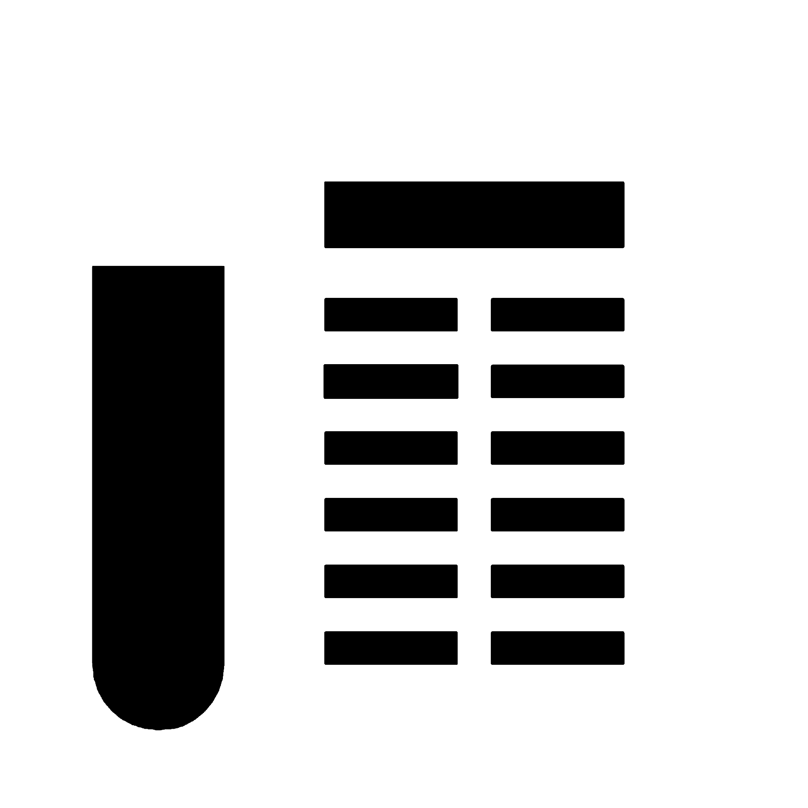

# NewsHub — Платформа для публикации статей

  
  
  
  
  
  
  
  **Современная платформа для публикации, чтения и обсуждения статей**
  
  [Демо](#-демо) • [Особенности](#-особенности) • [Установка](#-установка) • [Использование](#-использование)

## 📖 О проекте

**NewsHub** — это полнофункциональная веб-платформа для публикации и чтения статей с современным интерфейсом. Проект включает систему пользователей, лайков, комментариев, подписок и уведомлений.

### Основные цели проекта:
- Создание интуитивно понятной платформы для публикации контента
- Реализация социальных функций (лайки, комментарии, подписки)
- Адаптивный дизайн для всех устройств
- Работа без бэкенда (используется)
